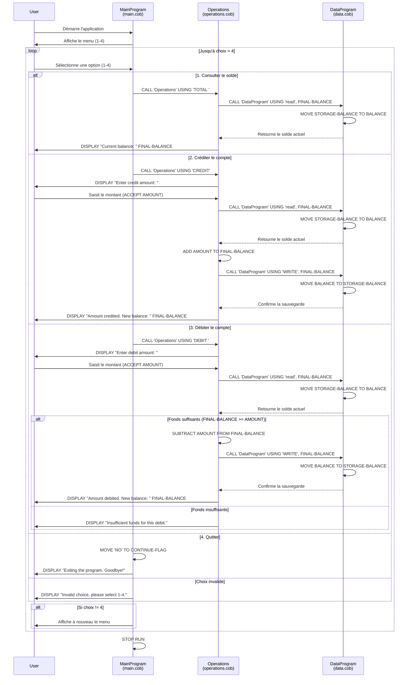

# Diagramme de séquence - Application de gestion de comptes COBOL

## Description du flux

Ce diagramme illustre l'architecture modulaire de l'application COBOL avec trois composants principaux :

- **MainProgram** : Interface utilisateur et contrôle du flux principal
- **Operations** : Logique métier pour les opérations bancaires
- **DataProgram** : Couche de persistance pour le stockage du solde

Chaque opération suit le pattern : **Interface → Logique → Données → Retour**
